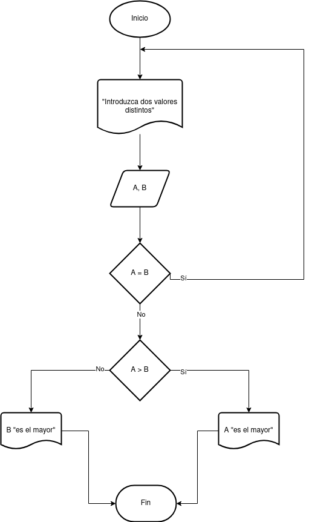
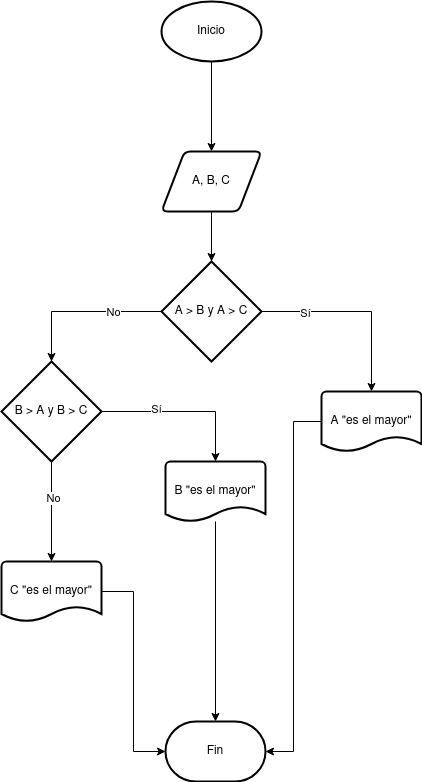

# Ejercicios

- [Ejercicio 1](#ejercicio1)
- [Ejercicio 2](#ejercicio2)

## Ejercicio 1 

Desarrolle un algoritmo que permita leer dos valores distintos, determinar cual de los dos valores es el
mayor y escribirlo.

### Diagrama de Flujo

### Pseudocódigo

Pasos:

- Inicio
- Inicializar variables: __A = 0, B = 0__
- Solicitar la introducción de dos valores distintos
- Leer los dos valores
- Asignarlos a las variables A y B
- Si __A = B__ Entonces vuelve a 3 porque los valores deben ser distintos
- Si __A > B__ Entonces
- Escribir __A, “Es el mayor”__
- De lo contrario: Escribir __B, “Es el mayor”__
- Fin_Si
- Fin

## Ejercicio 2 

Desarrolle un algoritmo que permita leer tres valores y almacenarlos en las variables A, B y C respectivamente. El algoritmo debe imprimir cual es el mayor y cual es el menor. Recuerde constatar que los tres valores introducidos por el teclado sean valores distintos. Presente un mensaje de alerta en caso de que se detecte la introducción de valores iguales.

### Diagrama de Flujo

### Pseudocódigo

- Inicio
- Inicializar las variables A, B y C
- Leer los tres valores
- Almacenar en las variables A, B y C
- Si __A > B y A > C__ Entonces
- Escribir __A “Es el mayor”__
- Sino
- Si __B > A y B > C__ Entonces
- Escribir __B “Es el mayor”__
- Sino
- Escribir __C “Es el mayor”__
- Fin_Si
- Fin_Si
- Fin