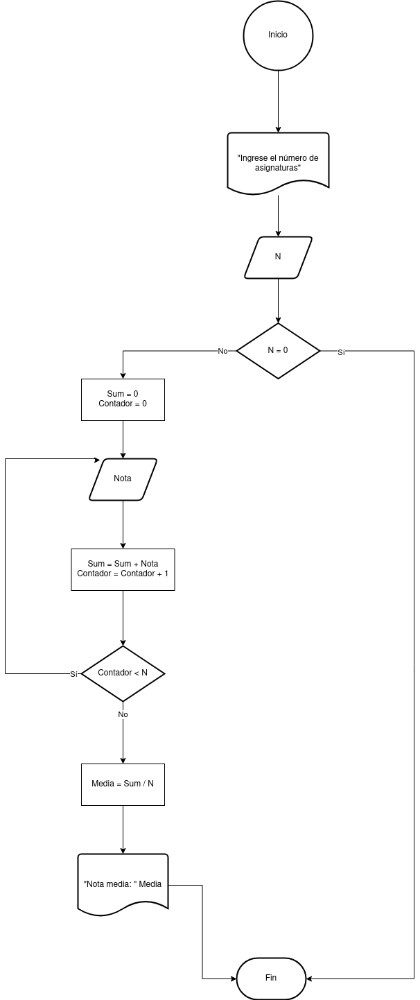

# Ejercicio 1 

Desarrolle un algoritmo que permita leer dos valores distintos, determinar cual de los dos valores es el mayor y escribirlo.

### Diagrama de Flujo

### Pseudocódigo

Pasos:
- Inicio
- Inicializar variables: __A = 0, B = 0__
- Solicitar la introducción de dos valores distintos
- Leer los dos valores
- Asignarlos a las variables A y B
- Si ___A = B___ Entonces vuelve a 3 porque los valores deben ser distintos
- Si ___A > B___ Entonces
  Escribir A, __“Es el mayor”__
- De lo contrario: Escribir __B, “Es el mayor”__
- Fin_Si
- Fin

# Ejercicio 8 

Desarrolle un algoritmo que permita calcular Promedio de Notas; finaliza cuando N = 0.

### Diagrama de Flujo

### Pseudocódigo

Pasos:
- Inicio
- Inicializar variable: N
- Escribir __"Ingrese el número de asignaturas"__
- Solicitar valor de N
- Inicializar Sum y Contador
- Mientras __N != 0__ y __Contador < N__
- Solicitar valor de Nota
- __Sum = Sum + Nota__
- __Contador = Contador + 1__
- finMientras
- __Media = Sum / N__
- Escribir "Nota media: " Media
- Fin

