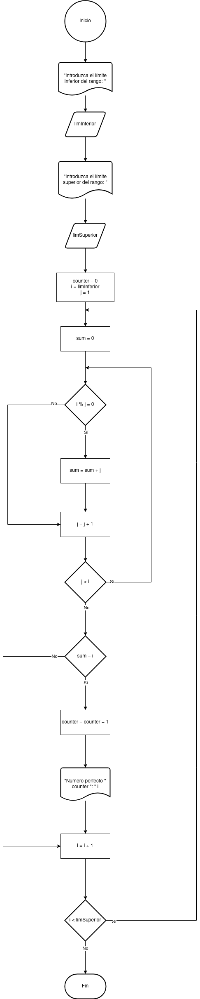

# Números Perfectos 

Un número perfecto es aquel que es igual a la suma de sus divisores propios (excluyendo él mismo). Por ejemplo, 6 es un número perfecto porque sus divisores propios son 1, 2 y 3, y 1 + 2 + 3 = 6.

El ejercicio consiste en escribir un programa que encuentre e imprima todos los números perfectos en un rango dado (por ejemplo, entre 1 y 1000).

### Diagrama de Flujo

### Pseudocódigo

