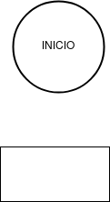

# Tarea 2 PRO

## Índice

- [Ejercicio 1](ejercicio01)

## Ejercicio 1 

Escribe un programa en Java que imprima el patrón siguiente:

1

2 3

4 5 6

7 8 9 10

### Diagrama de Flujo

### Pseudocódigo

