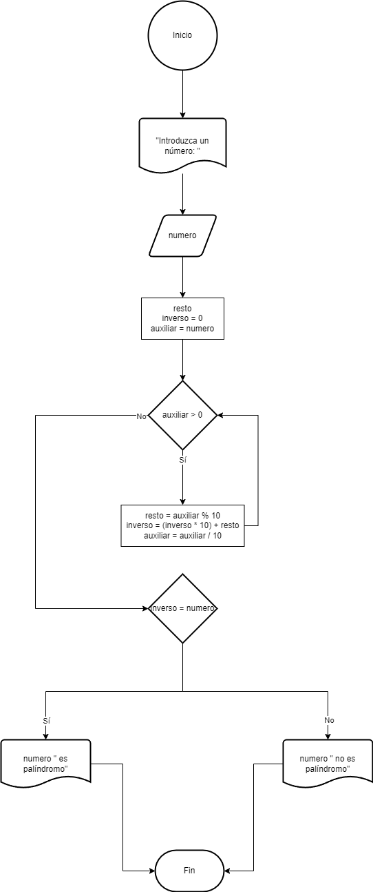

# Tarea 2 PRO

## Índice

- [Ejercicio 1](#ejercicio01)
- [Ejercicio 2](#ejercicio02)
- [Ejercicio 3](#ejercicio03)
- [Ejercicio 4](#ejercicio04)
- [Ejercicio 5](#ejercicio05)
- [Ejercicio 6](#ejercicio06)
- [Ejercicio 7](#ejercicio07)
- [Ejercicio 8](#ejercicio08)
- [Ejercicio 9](#ejercicio09)
- [Ejercicio 10](#ejercicio10)

## Ejercicio 1 

Escribe un programa en Java que imprima el patrón siguiente:

1

2 3

4 5 6

7 8 9 10

### Diagrama de Flujo

### Pseudocódigo

1. Inicio
2. Inicializar __sum = 1__, i = 0, j = 0
3. Escribir: __sum__ " "
4. __sum = sum + 1__
5. __j = j + 1__
6. Si __j <= i__, repetir desde el paso 3
7. De lo contrario, escribir un doble salto de línea
8. FinSi
9. __i = i + 1__
10. Si __i < 4__, repetir desde el paso 3
11. FinSi
12. Fin

## Ejercicio 2 

Escribe un programa en Java que encuentre el máximo común divisor (MCD) de dos números. Se debe solicitar los números por teclado.

### Diagrama de Flujo

### Pseudocódigo

1. Inicio
2. Escribir "Introduzca el valor de A: "
3. Leer __valorA__ por teclado
4. Escribir "Introduzca el valor de B: "
5. Leer __valorB__ por teclado
6. Inicializar: __mcd = 1__, __i = 1__
7. Si __i <= valorA__ e __i <= valorB__
8. Si __valorA % i = 0__ y __valorA % i = 0__
9. __mcd = i__
11. FinSi
12. __i = i + 1__
13. Repetir desde el paso 7
14. FinSi
15. "El MCD de " __valorA__ " y " __valorB__ " es: " __mcd__
16. Fin

## Ejercicio 3 

Escribe un programa en Java que encuentre el número de Fibonacci en la posición n.  Se debe solicitar el número por teclado.

### Diagrama de Flujo

### Pseudocódigo

1. Inicio
2. Escribir "Introduzca la posición del número de Fibonacci: "
3. Leer __posicion__ por teclado
4. Inicializar: __fibo1 = 0__, __fibo2 = 1__, __i = 1__
5. __fibo2 = fibo1 + fibo2__
6. __fibo1 = fibo2 - fibo1__
7. __i = i + 1__
8. Si __i < posicion__ repetir desde el paso 5
9. Escribir "El número de Fibonacci de la posición " __posicion__ " es: " __fibo1__
10. Fin

## Ejercicio 4 

Escribe un programa en Java que verifique si un número es palíndromo. Se debe solicitar el número por teclado.

### Diagrama de Flujo

### Pseudocódigo

1. Inicio
2. Escribir "Introduzca un número: "
3. Leer __numero__ por teclado
4. Inicializar: __resto__, __inverso = 0__, __auxiliar = numero__
5. Si __auxiliar > 0__
6. __resto = auxiliar % 10__
7. __inverso = (inverso * 10) + resto__
8. __auxiliar = auxiliar / 10__
9. Repetir desde el paso 5
10. FinSi
11. Si __inverso = numero__
12. Escribir __numero__ " es palíndromo"
13. Sino
14. Escribir __numero__ " no es palíndromo"
15. FinSi
16. Fin

## Ejercicio 5 

Escribe un programa en Java que imprima los primeros n términos de la secuencia de Fibonacci. Se debe solicitar el número n por teclado.

### Diagrama de Flujo

### Pseudocódigo

1. Inicio
2. Escribir "Introduzca la posición del número de Fibonacci: "
3. Leer __limit__ por teclado
4. Inicializar: __fibo1 = 0__, __fibo2 = 1__, __i = 0__
5. Escribir __fibo1__ " "
6. __fibo2 = fibo1 + fibo2__
7. __fibo1 = fibo2 - fibo1__
8. __i = i + 1__
9. Si __i < limit__ repetir desde el paso 5
10. Fin

