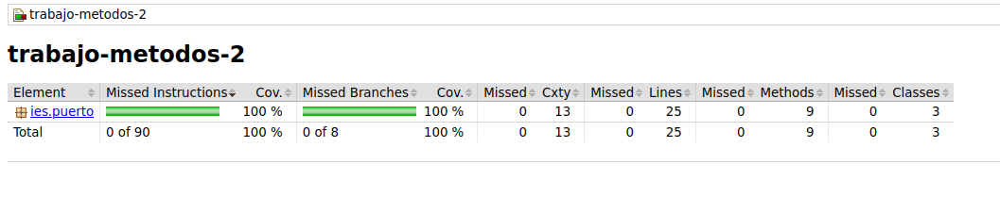

# Creación de métodos y pruebas

## Índice

1. [Ejercicio 1](#index01)
2. [Ejercicio 2](#index02)
3. [Ejercicio 3](#index03)
    - [Mostrar números](#index03-1)
    - [Mostrar suma](#index03-2)
    - [Orden creciente](#index03-3)
    - [Orden decreciente](#index03-4)
4. [Cobertura de código](#index04)

## Ejercicio 1 

Realizar un programa que calcule el sueldo de un trabajador, el programa debe de tener un método que reciba el numero de
horas que has trabajado en un mes, las horas se pagan a 10€.

#### Pseudocódigo

1. Pasar parámetro: __horas__
2. Retornar __horas * 10__

## Ejercicio 2 

Realiza un programa que tenga un método al que se le pase un número e indique si es positivo o negativo y si es par o
impar.

#### Pseudocódigo

1. Pasar parámetro: __número__
2. Inicializar cadena de texto: __resultado = "Número es negativo"__
2. Si el parámetro __número >= 0__
3. resultado = "Número es positivo"
4. FinSi
5. Si __numero % 2 = 0__
6. __resultado = resultado concatenado con " y par"__
7. Sino
8. __resultado = resultado concatenado con " e impar"__
9. Retornar __resultado__

## Ejercicio 3 

Realiza un programa que contenga los suficientes métodos para: pedir 5 números, mostrar los 5 números, muestra la suma y
los muestra en orden creciente y en orden decreciente.

### Mostrar números 

#### Pseudocódigo

1. Pasar lista como parámetro: __números__
2. Inicializar cadena de texto: __resultado__
3. Recorrer lista y añadir cada elemento a __resultado__
4. Retornar __resultado__

### Mostrar suma 

#### Pseudocódigo

1. Pasar lista como parámetro: __números__
2. Inicializar: __suma = 0__
3. Recorrer lista y sumar elementos: __suma = suma + elemento__
4. Retornar __suma__

### Orden creciente 

#### Pseudocódigo

1. Pasar lista como parámetro: __números__
2. Ordenar números de menor a mayor
3. Retornar cadena de lista ordenada

### Orden decreciente 

#### Pseudocódigo

1. Pasar lista como parámetro: __números__
2. Ordenar números de mayor a menor
3. Retornar cadena de lista ordenada

## Cobertura de código 

</img>

